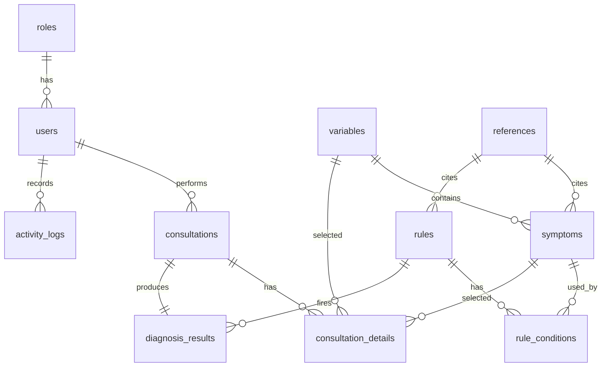
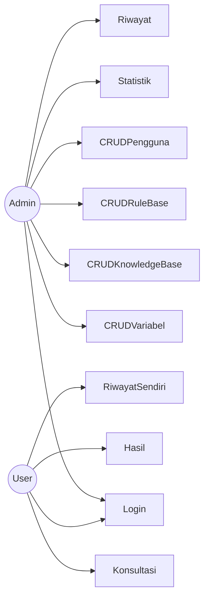
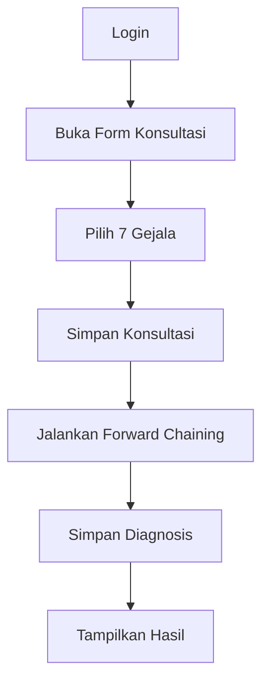
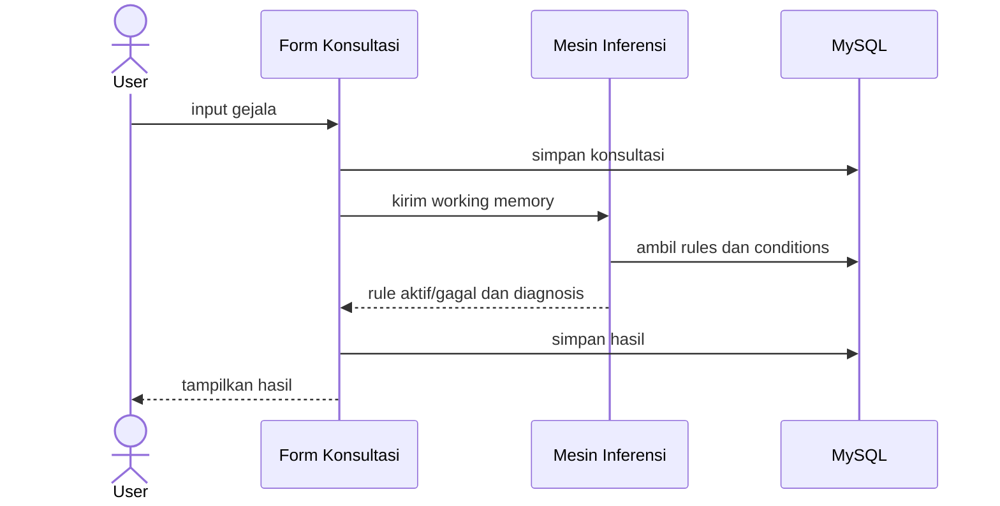
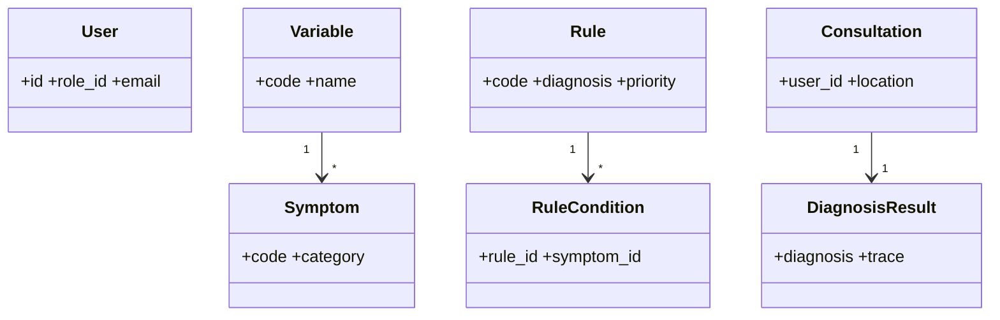
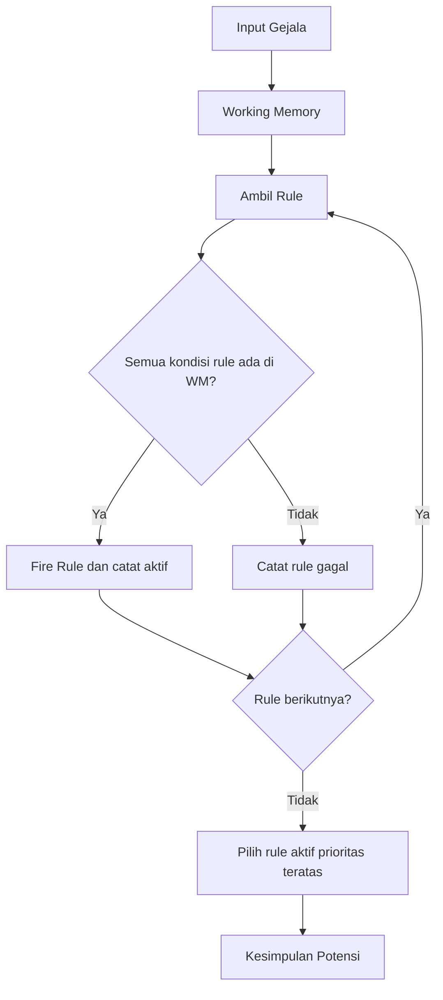

# Dokumentasi Desain

## ERD

## UML Use Case

## Activity Diagram Konsultasi

## Sequence Diagram

## Class Diagram

## Flowchart Forward Chaining

## Flow Aplikasi
Landing Page → Login → Dashboard/Admin atau Konsultasi/User → Mesin Inferensi → Hasil Diagnosa → Laporan/Export.
